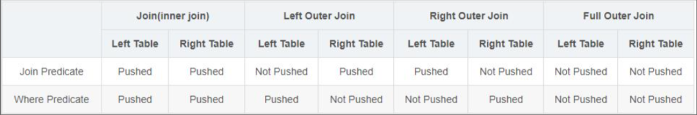

各位读者朋友，我想死你们了，今天我带着 calcite这个专题的第三篇文章来了，今天我们来说说sql重写，这可能也是大家都有需求的方面，我计划这个专题分为三篇来写：
* 上篇介绍 calcite 自带的 rule 做sql重写 
* 下篇介绍如何自定义 rule 来实现rewrite sql
* 第三篇作为番外，不限于calcite，泛化倒使用 AST + Vistor，来完成真正意义上的SQL语句重写。
那么我们就开始吧！ Let's go!!!

<!-- more -->

对于 `rewrite sql` 这个需求，大家都会有各自得需求，从我的角度来看，主要分为：

* 对象改写
    简单的例如对Sql对象的替换 `select a.firstname || a.lastname from a` 作为输入，实际查询 `select concat(b.first,b.last) from b` 
* 语法转换
    同源语义，但是由于数据库方言限制，`select top 10 * from a` 转换成 `select * from a limit 10`
* 性能优化  
    性能优化，一般会伴随语义和语法的转换，这里我们做等价代换的时候，还是要从关系代数的角度来证明规则的成立。在这里可能伴随着Sql语句得优化，也可能是对执行计划的优化。
 
下面我们以SQL优化为例，来看看`calcite`如何做。

## SQL 优化

### 基于规则优化（RBO）
基于规则的优化器（Rule-Based Optimizer，RBO）：根据优化规则对关系表达式进行转换，这里的转换是说一个关系表达式经过优化规则后会变成另外一个关系表达式，同时原有表达式会被裁剪掉，经过一系列转换后生成最终的执行计划。

RBO 中包含了一套有着严格顺序的优化规则，同样一条 SQL，无论读取的表中数据是怎么样的，最后生成的执行计划都是一样的。同时，在 RBO 中 SQL 写法的不同很有可能影响最终的执行计划，从而影响执行计划的性能。


### 基于成本优化（CBO）

基于代价的优化器(Cost-Based Optimizer，CBO)：根据优化规则对关系表达式进行转换，这里的转换是说一个关系表达式经过优化规则后会生成另外一个关系表达式，同时原有表达式也会保留，经过一系列转换后会生成多个执行计划，然后 CBO 会根据统计信息和代价模型 (Cost Model) 计算每个执行计划的 Cost，从中挑选 Cost 最小的执行计划。

`CBO = RBO + Cost Model + Model Iteration`

由上可知，CBO 中有两个依赖：统计信息和代价模型。统计信息的准确与否、代价模型的合理与否都会影响 CBO 选择最优计划。 从上述描述可知，CBO 是优于 RBO 的，原因是 RBO 是一种只认规则，对数据不敏感的呆板的优化器，而在实际过程中，数据往往是有变化的，通过 RBO 生成的执行计划很有可能不是最优的。事实上目前各大数据库和大数据计算引擎都倾向于使用 CBO，但是对于流式计算引擎来说，使用 CBO 还是有很大难度的，因为并不能提前预知数据量等信息，这会极大地影响优化效果，CBO 主要还是应用在离线的场景。

### 优化规则

无论是 RBO，还是 CBO 都包含了一系列优化规则，这些优化规则可以对关系表达式进行等价转换，常见的优化规则包含：

* 谓词下推 Predicate Pushdown
* 常量折叠 Constant Folding
* 列裁剪 Column Pruning


**谓词下推：**

我们可能已经理解了什么是谓词下推，基本的意思predicate pushdown 是将SQL语句中的部分语句( predicates 谓词部分) 可以被 “pushed” 下推到数据源或者靠近数据源的部分。



对于Join(Inner Join)、Full outer Join，条件写在on后面，还是where后面，性能上面没有区别；
* 对于Left outer Join ，右侧的表写在on后面、左侧的表写在where后面，性能上有提高；
* 对于Right outer Join，左侧的表写在on后面、右侧的表写在where后面，性能上有提高；
* 当条件分散在两个表时，谓词下推可按上述结论2和3自由组合；
* 所谓下推，即谓词过滤在map端执行；所谓不下推，即谓词过滤在reduce端执行
注意：如果在表达式中含有不确定函数，整个表达式的谓词将不会被pushed

**常量折叠**

常量折叠也是常见的优化策略，这个比较简单,例如，有一个常量表达式 10 + 30，如果不进行常量折叠，那么每行数据都需要进行计算，进行常量折叠后的结果如下图所示（ 对应 Calcite 中的 ReduceExpressionsRule.PROJECT_INSTANCE Rule）


**列裁剪**

列裁剪也是一个经典的优化规则，例如，一次查询并不需要扫描它的所有列值，而只需要列值 id，所以在扫描表之后需要将其他列进行裁剪，只留下列 id。这个优化带来的好处很明显，大幅度减少了网络 IO、内存数据量的消耗。

## Calcite优化器

Calcite提供了两类型的优化器，即上述所说的RBO优化器和CBO优化器，在Calcite中的具体实现类对应HepPlanner（RBO）和VolcanoPlanner（CBO）。

### HepPlanner优化器
HepPlanner简单理解就是两个循环，第一个循环会遍历用户提供的rule，第二个循环会遍历SQL树的节点，每当rule匹配到对应树节点的时候，会重新进行一遍循环。这个比较好理解。

### VolcanoPlanner优化器
VolcanoPlanner则相对复杂一些，它不是简单地应用rule，而是会使用动态规划算法，计算每种rule匹配后生成新的SQL树的Cost信息，与原先SQL树的Cost信息相比较，如果新的树的Cost比较低，那么才会真正应用对应的rule。


## 案例

### 代码解析

首先，我们根据上一节的内容，来构建一个带条件的查询

```java
RelNode opTree = relBuilder
                .scan("consumers")
                .scan("orders")
                .join(JoinRelType.INNER,
                        relBuilder.call(SqlStdOperatorTable.EQUALS,
                                relBuilder.field("id"),
                                relBuilder.field("user_id")))
                .filter(
                        relBuilder.call(SqlStdOperatorTable.EQUALS,
                                relBuilder.field("lastname"),
                                relBuilder.literal("jacky")))
                .project(
                        relBuilder.field("id"),
                        relBuilder.field("goods"),
                        relBuilder.field("price"),
                        relBuilder.field("firstname"),
                        relBuilder.field("lastname"))
                .sortLimit(0, 5, relBuilder.field("id"))
                .build();
```

接下来，我们在优化器里加入条件下退规则，这里我们用到上文提到得 `HepPlanner` 也就是 `RBO` 

```java
        HepProgramBuilder hepProgramBuilder = HepProgram.builder();
        hepProgramBuilder.addRuleInstance(FilterJoinRule.FilterIntoJoinRule.FilterIntoJoinRuleConfig.DEFAULT.toRule());
        HepProgram program = hepProgramBuilder.build();

        HepPlanner hepPlanner = new HepPlanner(program);
        hepPlanner.setRoot(opTree);
        RelNode r = hepPlanner.findBestExp();
```

* 添加规则
* 初始化 HepProgram 对象；
* 初始化 HepPlanner 对象，并通过 setRoot() 方法将 RelNode 树转换成 HepPlanner 内部使用的 Graph；
* 通过 findBestExp() 找到最优的 plan，规则的匹配都是在这里进行。

这里我们需要提一下，`addRuleInstance` 这个方法
```java
  /**
   * Adds an instruction to attempt to match a specific rule object.
   *
   * <p>Note that when this method is used, it is NOT necessary to add the
   * rule to the planner via {@link RelOptPlanner#addRule}; the instance
   * supplied here will be used. However, adding the rule to the planner
   * redundantly is good form since other planners may require it.
   *
   * @param rule rule to fire
   */
  public HepProgramBuilder addRuleInstance(RelOptRule rule) {
    return addInstruction(new HepInstruction.RuleInstance(rule));
  }
```
在添加 `RelOptRule` 规则得时候，`calcite 1.21` 版本以后如何实例化规则，进行了修改，老版本使用 `builder.addRuleInstance(FilterJoinRule.FilterIntoJoinRule.FILTER_ON_JOIN)` 

接下来打印一下执行计划，和查询结果就好了。完整DEMO代码如下：

```java

package com.dafei1288;


import org.apache.calcite.adapter.csv.CsvSchema;
import org.apache.calcite.adapter.csv.CsvTable;
import org.apache.calcite.plan.*;
import org.apache.calcite.plan.hep.HepPlanner;
import org.apache.calcite.plan.hep.HepProgram;
import org.apache.calcite.rel.RelNode;
import org.apache.calcite.rel.RelWriter;
import org.apache.calcite.rel.core.JoinRelType;
import org.apache.calcite.rel.externalize.RelWriterImpl;
import org.apache.calcite.schema.SchemaPlus;
import org.apache.calcite.sql.fun.SqlStdOperatorTable;
import org.apache.calcite.sql.parser.SqlParser;
import org.apache.calcite.tools.FrameworkConfig;
import org.apache.calcite.tools.Frameworks;
import org.apache.calcite.tools.RelBuilder;
import org.apache.calcite.rel.rules.FilterJoinRule;
import org.apache.calcite.tools.RelRunners;


import java.io.File;
import java.io.PrintWriter;
import java.sql.ResultSet;


public class CalciteSqlRewriteCase {
    public static void main(String[] args) throws Exception {

        SchemaPlus rootSchema = Frameworks.createRootSchema(true);
        String csvPath = "src\\main\\resources\\db";
        CsvSchema csvSchema = new CsvSchema(new File(csvPath), CsvTable.Flavor.SCANNABLE);
        rootSchema.add("consumers", csvSchema.getTable("consumers"));
        rootSchema.add("orders", csvSchema.getTable("orders"));

        FrameworkConfig frameworkConfig = Frameworks.newConfigBuilder()
                .parserConfig(SqlParser.Config.DEFAULT)
                .defaultSchema(rootSchema)
                .build();


        RelBuilder relBuilder = RelBuilder.create(frameworkConfig);

        RelNode cnode = relBuilder.scan("consumers").build();
        System.out.println("==> "+ RelOptUtil.toString(cnode));

        cnode = relBuilder.scan("consumers").project(relBuilder.field("firstname"),
                relBuilder.field("lastname")).build();
        System.out.println("==> "+RelOptUtil.toString(cnode));

        RelNode opTree = relBuilder
                .scan("consumers")
                .scan("orders")
                .join(JoinRelType.INNER,
                        relBuilder.call(SqlStdOperatorTable.EQUALS,
                                relBuilder.field("id"),
                                relBuilder.field("user_id")))
                .filter(
                        relBuilder.call(SqlStdOperatorTable.EQUALS,
                                relBuilder.field("lastname"),
                                relBuilder.literal("jacky")))
                .project(
                        relBuilder.field("id"),
                        relBuilder.field("goods"),
                        relBuilder.field("price"),
                        relBuilder.field("firstname"),
                        relBuilder.field("lastname"))
                .sortLimit(0, 5, relBuilder.field("id"))
                .build();

        RelWriter rw = new RelWriterImpl(new PrintWriter(System.out, true));
        opTree.explain(rw);


        System.out.println();
        System.out.println();
        System.out.println();


        HepProgramBuilder hepProgramBuilder = HepProgram.builder();
        hepProgramBuilder.addRuleInstance(FilterJoinRule.FilterIntoJoinRule.FilterIntoJoinRuleConfig.DEFAULT.toRule());
        HepProgram program = hepProgramBuilder.build();

        HepPlanner hepPlanner = new HepPlanner(program);
        hepPlanner.setRoot(opTree);
        RelNode r = hepPlanner.findBestExp();
        r.explain(rw);

        System.out.println();
        System.out.println();
        System.out.println();

        ResultSet result = RelRunners.run(r).executeQuery();
        int columns = result.getMetaData().getColumnCount();
        while (result.next()) {
            System.out.println(result.getString(1) + " " + result.getString(2));
        }
    }
}


```

### 结果展示

```bash
==> LogicalTableScan(table=[[consumers]])

==> LogicalProject(firstname=[$1], lastname=[$2])
  LogicalTableScan(table=[[consumers]])

8:LogicalSort(sort0=[$0], dir0=[ASC], fetch=[5])
  7:LogicalProject(id=[$0], goods=[$5], price=[$6], firstname=[$1], lastname=[$2])
    6:LogicalFilter(condition=[=($2, 'jacky')])
      5:LogicalJoin(condition=[=($0, $4)], joinType=[inner])
        3:LogicalTableScan(table=[[consumers]])
        4:LogicalTableScan(table=[[orders]])


17:LogicalSort(sort0=[$0], dir0=[ASC], fetch=[5])
  15:LogicalProject(id=[$0], goods=[$5], price=[$6], firstname=[$1], lastname=[$2])
    22:LogicalJoin(condition=[=($0, $4)], joinType=[inner])
      19:LogicalFilter(condition=[=($2, 'jacky')])
        3:LogicalTableScan(table=[[consumers]])
      4:LogicalTableScan(table=[[orders]])

1 book

Process finished with exit code 0

```

### 结果分析

可以看到我们的执行计划从

```
8:LogicalSort(sort0=[$0], dir0=[ASC], fetch=[5])
  7:LogicalProject(id=[$0], goods=[$5], price=[$6], firstname=[$1], lastname=[$2])
    6:LogicalFilter(condition=[=($2, 'jacky')])
      5:LogicalJoin(condition=[=($0, $4)], joinType=[inner])
        3:LogicalTableScan(table=[[consumers]])
        4:LogicalTableScan(table=[[orders]])
```
变成了

```
17:LogicalSort(sort0=[$0], dir0=[ASC], fetch=[5])
  15:LogicalProject(id=[$0], goods=[$5], price=[$6], firstname=[$1], lastname=[$2])
    22:LogicalJoin(condition=[=($0, $4)], joinType=[inner])
      19:LogicalFilter(condition=[=($2, 'jacky')])
        3:LogicalTableScan(table=[[consumers]])
      4:LogicalTableScan(table=[[orders]])
```
也就实现了条件下推。

好了，上半部分我们就讲到这里，下一篇，我们来尝试自定义calcite的rule，来rewrite sql。


## 参考资料

https://zhuanlan.zhihu.com/p/61661909

https://github.com/tzolov/calcite-sql-rewriter/tree/master

https://guimy.tech/calcite/2021/01/02/introduction-to-apache-calcite.html

http://matt33.com/2019/03/17/apache-calcite-planner/

https://zhuanlan.zhihu.com/p/397365617

