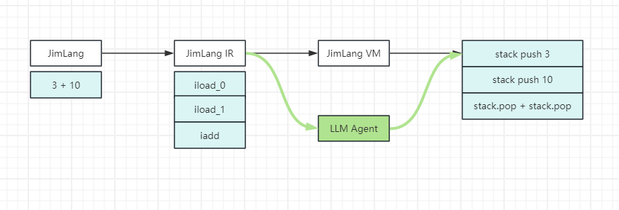

最近在给jimlang升级，从ast解析型变成编译成中间码（IR）模拟java的字节码形式，交给栈机去执行，在实现栈机的过程中，突发奇想，是不是可以通过LLM的agnet来完成栈机的任务呢？虽然执行效率上就别提了，但是这个思路还是挺有意思的，于是说写就写，一个晚上的时候，完成了极简原型。

整体架构如下：

<!-- more -->

受到LLM agent的启发：

DEMO如下：

jimlang的栈机实现部分

